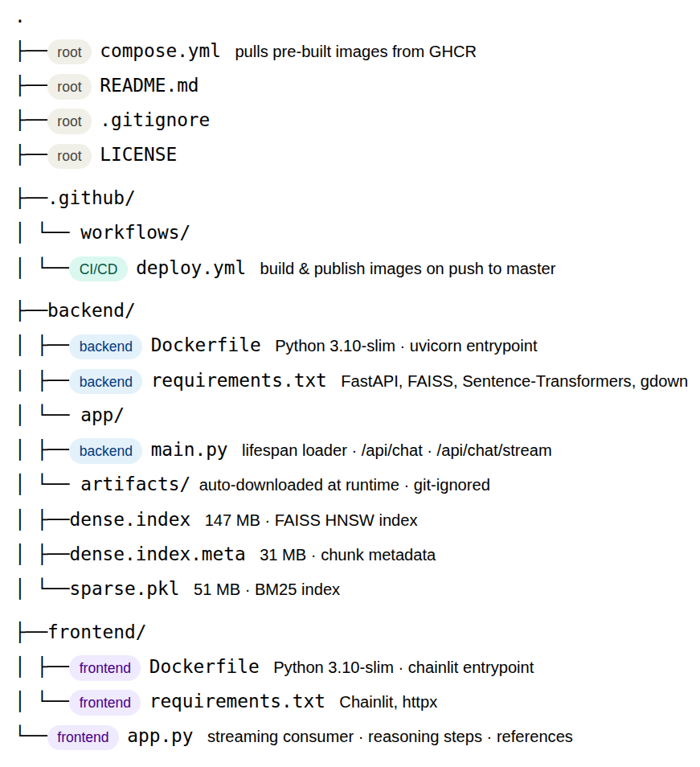

# Scientific RAG Question-Answering Application

> **Production-ready Retrieval-Augmented Generation (RAG) application** that retrieves and synthesises answers from a corpus of scientific NLP papers, with real-time token streaming and an interactive chat UI.

---

## Table of Contents

1. [Project Description & Objectives](#1-project-description--objectives)
2. [System Architecture](#2-system-architecture)
3. [Technology Stack](#3-technology-stack)
4. [Environment Setup & Hardware Requirements](#4-environment-setup--hardware-requirements)
5. [Data Provenance & Artifact Acquisition](#5-data-provenance--artifact-acquisition)
6. [Project Directory Structure](#6-project-directory-structure)
7. [How to Run](#7-how-to-run)
8. [API Reference](#8-api-reference)
9. [RAG Pipeline Details](#9-rag-pipeline-details)
10. [License](#10-license)

---

## 1. Project Description & Objectives

### Problem Statement

Researchers and engineers frequently need precise, citation-backed answers to technical questions spanning thousands of scientific publications. Traditional keyword search returns a list of documents—the user must still read, compare, and synthesise the information manually.

### Objective

Deploy a **Retrieval-Augmented Generation (RAG) system** that:

1. **Retrieves** the most relevant passages from a pre-indexed corpus of scientific NLP papers using hybrid search (dense FAISS + sparse BM25) and cross-encoder reranking.
2. **Generates** a grounded, streamed answer via a local LLM (Ollama / Llama 3 or GPU-accelerated Transformers).
3. **Serves** the full pipeline behind a FastAPI backend and an interactive Chainlit chat UI, both containerised with Docker Compose for one-command deployment.
4. **Supports multi-turn conversation memory**, so users can ask follow-up questions in context.

### Key Features

| Feature | Description |
|---|---|
| **Hybrid Retrieval** | FAISS dense vectors + BM25 sparse index for high recall |
| **Cross-Encoder Reranking** | Re-scores top-50 candidates to surface the most relevant 7 |
| **CRAG Gate** | Confidence threshold rejects low-quality retrievals before generation |
| **Real-Time Streaming** | Token-by-token NDJSON streaming from backend to frontend |
| **Transparent Reasoning** | `<Reasoning>` and `<Final Answer>` tags expose the LLM's chain-of-thought |
| **Cited References** | Only documents actually cited in the answer are shown, with click-to-expand content |
| **Multi-Turn Memory** | Last 6 conversation pairs (12 messages) are injected into the prompt for follow-up questions |
| **Auto Artifact Download** | FAISS indices are pulled from Google Drive on first boot if not already present |
| **CI/CD Pipeline** | GitHub Actions builds and publishes Docker images to GHCR on every push to `master` |

---

## 2. System Architecture

<p align="center">
  
</p>


## 3. Technology Stack

| Layer | Technology | Version |
|---|---|---|
| **Backend API** | FastAPI + Uvicorn | 0.133.0 |
| **Frontend Chat UI** | Chainlit | 2.9.6 |
| **Dense Retrieval** | FAISS (CPU) | 1.13.2 |
| **Sparse Retrieval** | BM25 (rank-bm25) | 0.2.2 |
| **Embedding Model** | Sentence-Transformers | latest |
| **Reranker** | Cross-Encoder (Adapters) | 1.2.0 |
| **LLM (CPU)** | Ollama — Llama 3 | 0.6.1 |
| **LLM (GPU)** | Transformers (auto-detected) | latest |
| **Containerisation** | Docker Compose | v2+ |
| **CI/CD** | GitHub Actions → GHCR | — |
| **Container Registry** | GitHub Container Registry (GHCR) | — |
| **Language** | Python | 3.10 |

---

## 4. Environment Setup & Hardware Requirements

### Hardware

| Tier | Configuration | Notes |
|---|---|---|
| **Minimum (CPU)** | 8 GB RAM, 4 CPU cores, 10 GB disk | Uses Ollama for generation (~2-5 tokens/s) |
| **Recommended (GPU)** | 16 GB RAM, NVIDIA GPU with ≥ 8 GB VRAM, CUDA 11.8+ | Auto-detected; uses Transformers backend for faster inference |

### Prerequisites

| Dependency | Install Guide |
|---|---|
| **Docker Engine** + **Docker Compose v2** | [docs.docker.com/get-docker](https://docs.docker.com/get-docker/) |
| **Ollama** (if using CPU generation) | [ollama.com/download](https://ollama.com/download) |
| **NVIDIA Container Toolkit** (GPU only) | [docs.nvidia.com/datacenter/cloud-native](https://docs.nvidia.com/datacenter/cloud-native/container-toolkit/install-guide.html) |

### Ollama Setup (CPU Mode)

```bash
# Install Ollama (Linux)
curl -fsSL https://ollama.com/install.sh | sh

# Pull the Llama 3 model (~4.7 GB)
ollama pull llama3

# Verify Ollama is running
curl http://localhost:11434/api/tags
```

---

## 5. Data Provenance & Artifact Acquisition

The retrieval indices are **pre-built** from a corpus of scientific NLP papers (processed in the companion research project [RAG-for-Scientific-QA](https://github.com/mnguegnang/RAG-for-Scientific-QA)). Raw papers are **not** included in this repository.

### Artifact Files

| File | Size | Description | Google Drive ID |
|---|---|---|---|
| `dense.index` | ~147 MB | FAISS HNSW index of dense embeddings | `1l40d9f-yleEBzOp3zGPH0LHa28XxIyoq` |
| `dense.index.meta` | ~31 MB | Paper metadata (titles, IDs, text) | `1Qxf1mKFEDKKOvEwphZJKv7mtp53MndYf` |
| `sparse.pkl` | ~51 MB | Pickled BM25 sparse index | `1F74_vEnlRC2St36twyhH7Ve5gHDU5rA4` |

### Acquisition

Artifacts are **automatically downloaded** from Google Drive on the first container boot (via `gdown`). No manual action is required unless you prefer to pre-download:

```bash
# Optional: pre-download artifacts to skip first-boot download
pip install gdown
gdown --fuzzy "https://drive.google.com/file/d/1l40d9f-yleEBzOp3zGPH0LHa28XxIyoq/view" -O backend/app/artifacts/dense.index
gdown --fuzzy "https://drive.google.com/file/d/1Qxf1mKFEDKKOvEwphZJKv7mtp53MndYf/view" -O backend/app/artifacts/dense.index.meta
gdown --fuzzy "https://drive.google.com/file/d/1F74_vEnlRC2St36twyhH7Ve5gHDU5rA4/view" -O backend/app/artifacts/sparse.pkl
```

Artifacts are downloaded inside the running container on first boot. Since the current `compose.yml` uses pre-built images without a volume mount, artifacts are re-downloaded if the container is recreated. For persistent caching, add a volume mount:

```yaml
services:
  backend-api:
    volumes:
      - ./backend/app/artifacts:/app/artifacts:rw
```

---

## 6. Project Directory Structure


<p align="center">
  
</p>


## 7. How to Run

### Prerequisites checklist

Before running, confirm the following are installed on your Linux host:

- Docker Engine + Docker Compose v2 — `docker compose version`
- Ollama — `ollama --version` (CPU mode only; skip for GPU-only Transformers path)
- *(GPU only)* NVIDIA Container Toolkit — `nvidia-ctk --version`

See [Section 4](#4-environment-setup--hardware-requirements) for install links.

---

### Step 1 — Clone the repository

```bash
git clone https://github.com/mnguegnang/RAG-app-scientific-QA.git
cd RAG-app-scientific-QA
```

---

### Step 2 — Start Ollama and pull the model (CPU mode)

> **Skip this step** if you are running in GPU mode (the backend auto-detects a CUDA device
> and uses the HuggingFace Transformers backend instead of Ollama).

```bash
# Start Ollama daemon (skip if it is already running as a system service)
ollama serve &

# Wait until the Ollama API is accepting requests
until curl -s http://localhost:11434/api/tags > /dev/null 2>&1; do sleep 2; done
echo "Ollama ready"

# Pull the Llama 3 model (~4.7 GB — only required once; cached on disk afterwards)
ollama pull llama3
```

---

### Step 3 — Pull images and launch

```bash
docker compose pull          # Pull frozen images from GHCR
docker compose up -d         # Start both services in the background
```

> **macOS / Windows (Docker Desktop):** `network_mode: "host"` is a Linux-only feature.
> Docker Desktop runs containers inside a Linux VM, so `localhost` inside the container
> refers to that VM — not your machine. Pass `OLLAMA_URL` explicitly so the backend can
> reach your host-installed Ollama:
> ```bash
> OLLAMA_URL=http://host.docker.internal:11434/api/generate docker compose up -d
> ```

---

### Step 4 — Wait for the pipeline to initialise

> **First boot takes 10–20 minutes** on a standard connection. The backend must download
> the FAISS indices (~230 MB), the Sentence-Transformers embedding model (~400 MB), and
> the cross-encoder reranker (~100+ MB) before it is ready.
> Subsequent starts are instant (models are cached inside the container layer).

```bash
# Stream startup logs — wait for the line "RAG Pipeline is LIVE", then press Ctrl+C
docker compose logs -f backend-api
```

```bash
# Poll the health endpoint until the pipeline is loaded (run this in a second terminal)
until curl -sf http://localhost:8080/health | grep -q '"status":"healthy"'; do
  echo "Waiting for backend…"; sleep 10
done
echo "Backend is healthy — ready to use"
```

---

### Step 5 — Open the application

| Service | URL |
|---|---|
| **Chat UI (Chainlit)** | [http://localhost:8001](http://localhost:8001) |
| **Backend API docs** | [http://localhost:8080/docs](http://localhost:8080/docs) |

---

### Stopping

```bash
docker compose down
```

---

### Updating to the latest version

```bash
docker compose pull          # Pull latest images from GHCR
docker compose up -d         # Recreate containers with new images
```

---

### CI/CD Pipeline — Automatic Image Publishing

This project uses a **GitHub Actions CI/CD pipeline** (`.github/workflows/deploy.yml`) that
automatically builds and publishes Docker images to the **GitHub Container Registry (GHCR)**
on every push to the `master` branch.

| Step | Action |
|---|---|
| **Trigger** | Push to `master` branch |
| **Build** | Builds `backend/Dockerfile` and `frontend/Dockerfile` on GitHub-hosted runners |
| **Publish** | Pushes images to `ghcr.io/mnguegnang/rag-app-scientific-qa-backend:latest` and `…-frontend:latest` |
| **Deploy** | On the production host, run `docker compose pull && docker compose up -d` to update |

Images are **frozen at CI time** (not built on the deployment host), ensuring reproducible
deployments across environments.

---

## 8. API Reference

### `POST /api/chat`

Synchronous single-shot endpoint.

**Request:**
```json
{
  "prompt": "What is the attention mechanism in transformers?",
  "history": [
    {"role": "user", "content": "previous question"},
    {"role": "assistant", "content": "previous answer"}
  ]
}
```

**Response:**
```json
{
  "answer": "The attention mechanism allows ...",
  "contexts": ["document text 1", "document text 2"]
}
```

### `POST /api/chat/stream`

Real-time NDJSON streaming endpoint. Each line is a JSON object:

| `type` | `data` | Description |
|---|---|---|
| `progress` | `"retrieve_start"` / `"retrieve_done"` / `"rerank_start"` / `"rerank_done"` / `"generate_start"` | Pipeline stage signals |
| `contexts` | `[{id, title, text, preview}]` | Retrieved and reranked documents with metadata |
| `token` | `"word "` | Streamed LLM output token |
| `error` | `"message"` | Error description |

---

## 9. RAG Pipeline Details

The inference pipeline executes in three stages:

### Stage 1 — Hybrid Retrieval
- **Dense search**: FAISS HNSW index with Sentence-Transformer embeddings returns top-50 candidates.
- **Sparse search**: BM25 keyword index provides complementary lexical matches.
- Results are fused for broad recall.

### Stage 2 — Cross-Encoder Reranking
- A cross-encoder model re-scores the top-50 candidates.
- The best 7 documents are selected for generation context.

### Stage 3 — Conditional Generation (CRAG)
- **CRAG gate**: If the best reranker score falls below a confidence threshold, the system returns a low-confidence warning instead of hallucinating.
- **LLM generation**: The prompt includes the 7 retrieved passages, conversation history, and structured XML tags (`<Reasoning>`, `<Final Answer>`) to enforce chain-of-thought reasoning.
- **Streaming**: Tokens are pushed via an async queue to the NDJSON endpoint as they are generated.

---

## 10. License

This project is released under the [MIT License](LICENSE).

---

## Related Projects

- [RAG-for-Scientific-QA](https://github.com/mnguegnang/RAG-for-Scientific-QA) — The research project where the retrieval indices and RAG pipeline were originally developed and evaluated.

---

## Acknowledgements

This repository was initially scaffolded from the
[Full Stack FastAPI Template](https://github.com/fastapi/full-stack-fastapi-template)
by [Sebastián Ramírez (tiangolo)](https://github.com/tiangolo), released under the MIT License.
All application code — including the RAG pipeline, FastAPI backend, Chainlit frontend, and Docker
Compose orchestration — is original work and is not derived from the template's source code.
